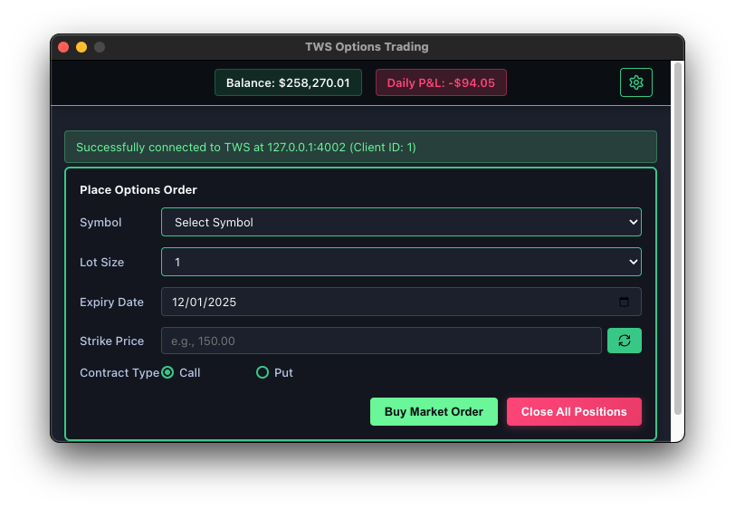
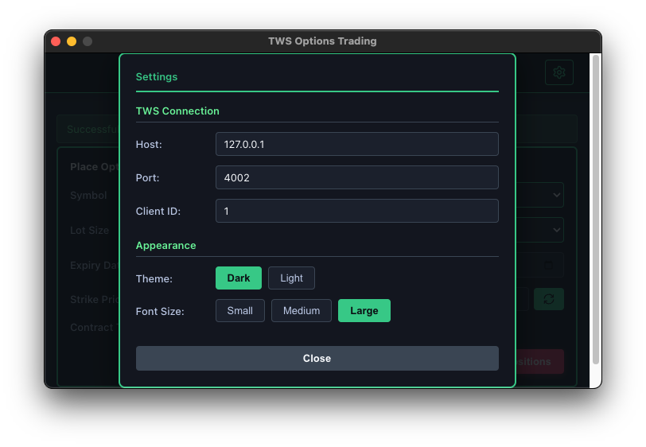
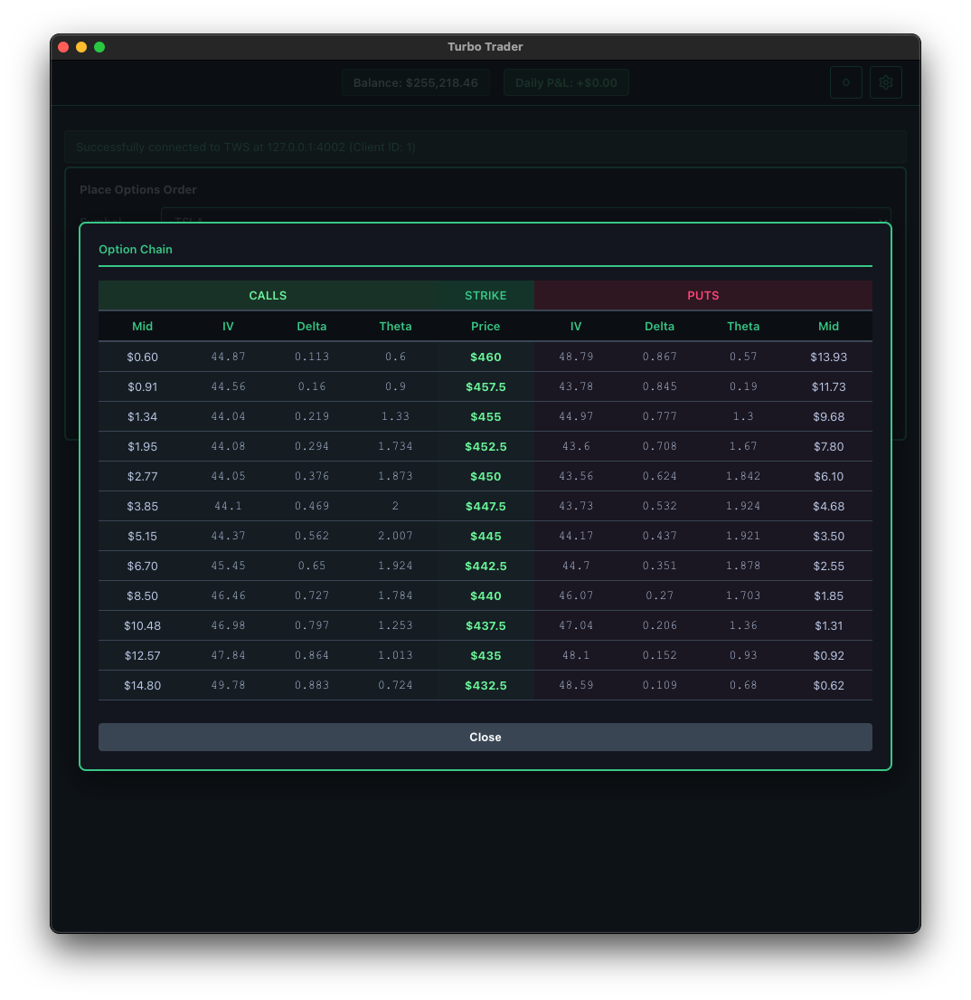

# Turbo Trader

A lightning-fast macOS application for options trading with Interactive Brokers TWS/IB Gateway.







## Features

- ⚡ Quick setup with automated install script
- � Real-time options trading interface
- 💰 Auto-populate strike prices
- 📊 Live portfolio balance and P&L tracking
- ️ Stop Loss & Take Profit with bracket orders
- 🎨 Dark/Light themes with customizable fonts
- 📝 Ticker watchlist with validation

## Quick Start (macOS)

### 1. Prerequisites

- Node.js 16+ ([Download](https://nodejs.org/))
- Python 3.7+ (usually pre-installed on macOS)
- TWS or IB Gateway ([Download](https://www.interactivebrokers.com/en/trading/tws.php))

### 2. Enable API in TWS/Gateway

1. Open TWS or IB Gateway
2. Go to **File → Global Configuration → API → Settings**
3. ✅ Check **Enable ActiveX and Socket Clients**
4. ✅ Add `127.0.0.1` to **Trusted IP Addresses**

### 3. Install & Run

```bash
cd turbo-trader
./install.sh
./run.sh
```

That's it! The app will auto-connect to TWS on startup.

## Configuration

Click the **gear icon** (⚙️) to access settings:

### Connection
- **Host:** `127.0.0.1`
- **Port:** `4002` (IB Gateway Live) or `7496` (TWS Paper)
- **Client ID:** `1`

### Watchlist
Add tickers to your watchlist. Only valid tickers with options trading enabled are accepted.

### Risk Management
- **Stop Loss %**: Auto-place stop order below fill price
- **Take Profit %**: Auto-place limit order above fill price
- Use `--` to disable

**Example:** 
- Fill @ $3.00, SL 20%, TP 30%
- Stop order @ $2.40, Limit order @ $3.90

## Trading Hours

Orders are only accepted during market hours:
- **9:30 AM - 4:00 PM ET, Monday-Friday**

## Common Ports

- `7496` - TWS Paper Trading
- `7497` - TWS Live Trading  
- `4001` - IB Gateway Paper Trading
- `4002` - IB Gateway Live Trading

## Troubleshooting

**Connection Failed?**
- ✅ TWS/IB Gateway is running
- ✅ API is enabled in settings
- ✅ Correct port number
- ✅ No other app using same Client ID

**Need Help?**
Run `./install.sh` again to reinstall dependencies.

---

**Happy Trading! 📈**
